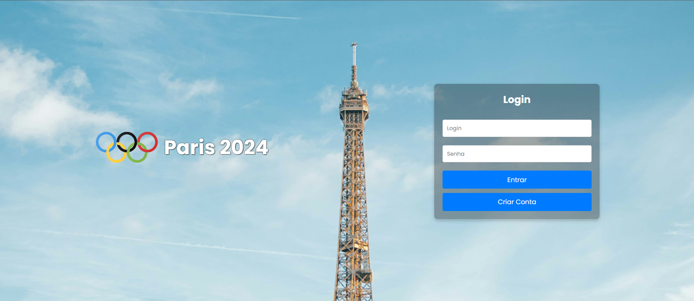
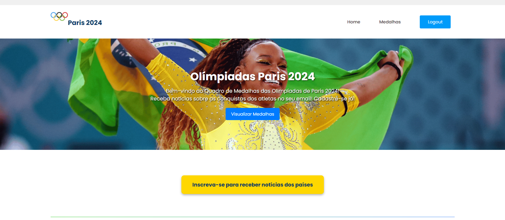
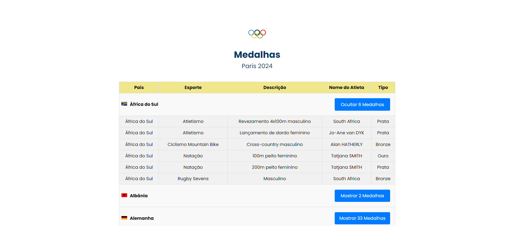
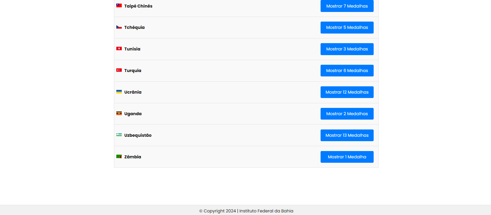
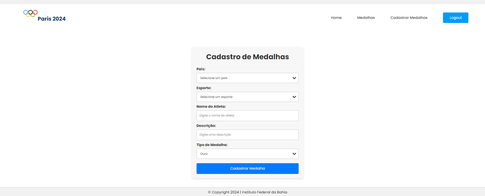

# Sistema de Visualização do Quadro de Medalhas das Olimpíadas de Paris 2024

# Disciplina: Programação Web

# Objetivo
Este projeto visa o desenvolvimento de um sistema web completo que permite aos usuários visualizar o quadro de medalhas das Olimpíadas em tempo real. O sistema detalha as medalhas conquistadas por cada país, classificadas por esporte e tipo (ouro, prata, bronze). Além disso, oferece um sistema de notificações por e-mail, onde usuários cadastrados podem seguir países específicos e receber alertas automáticos sempre que esses países ganharem novas medalhas. A aplicação é desenvolvida com Spring Boot no backend e React.js no frontend, utilizando mensageria para garantir uma comunicação eficiente entre os componentes do sistema.

# Funcionalidades Principais
- Visualização do Quadro de Medalhas
- Apresentação do quadro de medalhas atualizado, destacando a contagem de medalhas por país.
- Exibição dos esportes nos quais cada país conquistou suas medalhas.
- Sistema de Notificações por E-mail
- Inscrição de usuários para seguir países de sua escolha.
- Envio automático de notificações por e-mail quando os países seguidos conquistarem novas medalhas.
- Cadastro de Medalhas
- Interface para adicionar novas medalhas, especificando país, esporte e tipo de medalha.
- Atualização automática do quadro de medalhas e disparo de notificações por e-mail após o registro de novas medalhas.

# Tecnologias Utilizadas

# Backend 
- Framework: Spring Boot
- Banco de Dados: PostgreSQL
- Mensageria: RabbitMQ
- Repositório para acesso ao código do BackEnd: https://github.com/CarolLimav/MedalhasOlimpicasBackEnd

# Frontend
- Framework: React.js
- Ferramentas de Estilo: CSS/Bootstrap

# Telas

